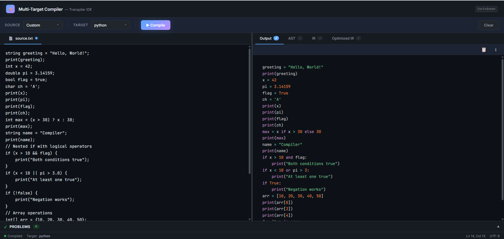
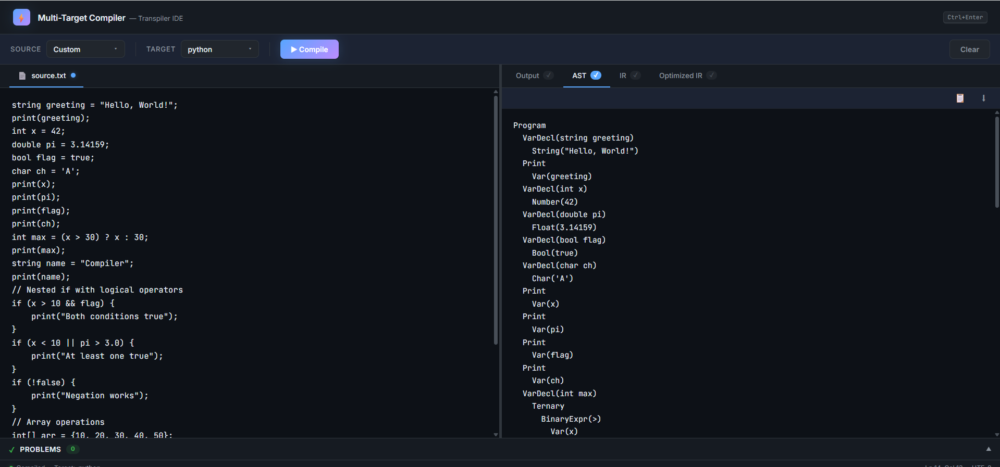
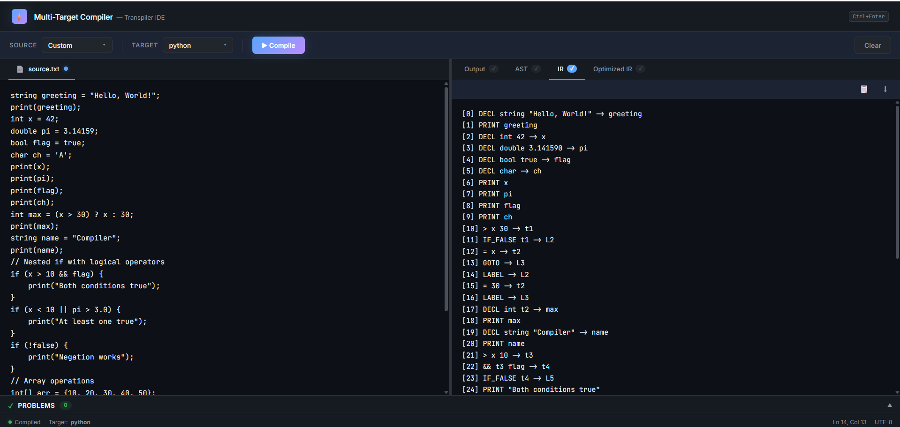
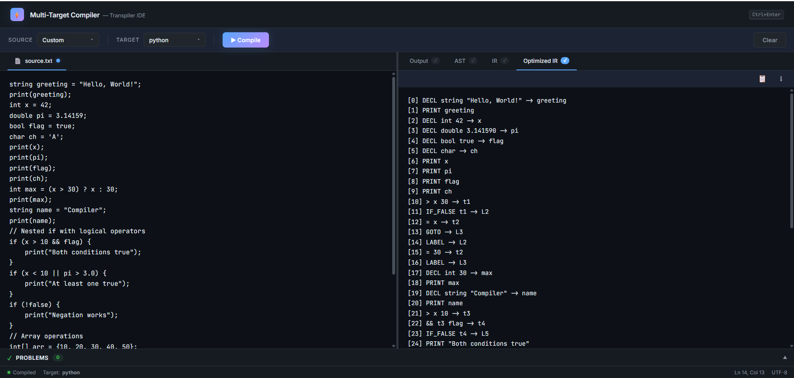

# Multi-Target Source-to-Source Compiler

A multi-target source-to-source compiler/transpiler that converts a C-like input language to **Python**, **C++**, and **Java**.

## Project Status

Current stage: Active Development

Implemented:

- [x] Lexer with 60+ token types
- [x] Recursive descent parser
- [x] AST generation
- [x] Semantic analysis
- [x] IR generation
- [x] Basic optimizations
- [x] Python/C++/Java code generation

Under development:

- [ ] Advanced OOP support
- [ ] Constructor parsing
- [ ] Complex object initialization
- [ ] Full library mapping
- [ ] Advanced function signatures

## Supported

- Variables and primitive types
- Arithmetic expressions
- If/Else
- While loops
- For loops
- Recursive functions
- Arrays
- Exception handling
- Basic OOP
- Semantic analysis
- IR generation

## Planned

Constructor initialization
Full inheritance handling
Templates/generics
Async/threading
Complete standard library mapping
Advanced object expressions

## Project Structure

```text
multitarget-compiler-transpiler/
│
├── compiler.cpp        # Core compiler implementation
├── app.py              # Flask web application
├── README.md           # Project documentation
├── .gitignore
│
├── screenshots/
│   ├── ui.png
│   ├── ast.png
│   ├── ir.png
│   └── optimized_ir.png
│
├── templates/
│   └── index.html      # Frontend page
│
├── static/
│   └── style.css       # UI styling
│
├── tests/
│   ├── test_binary_search.txt
│   ├── test_control_flow.txt
│   ├── test_datatypes.txt
│   ├── test_exception.txt
│   ├── test_linked_list.txt
│   ├── test_oop.txt
│   ├── test_recursive.txt
│   └── test_stack.txt
```

## Architecture

Input Source Code
       ↓
    [Lexer]         60+ token types
       ↓
    [Parser]        Recursive descent, full operator precedence
       ↓
     [AST]          30+ node types (shared_ptr)
       ↓
 [Semantic Analyzer] Symbol table, scope checking, type inference
       ↓
  [IR Generator]    Extended intermediate representation
       ↓
  [Optimizer]       Constant folding, dead code elimination,
       ↓            copy propagation, algebraic simplification
 [Code Generator]   AST-walking generators for Python/C++/Java
       ↓
   Output Code


## Contributing

Contributions are welcome.

Steps:

1. Fork the repository
2. Create a feature branch

```bash
git checkout -b feature-name
```

3. Commit changes

```bash
git commit -m "Added feature"
```

4. Push changes

```bash
git push origin feature-name
```

5. Open a Pull Request


## Screenshots

### Web Interface


### AST View


### IR View


### Optimized IR


```
## Build

```bash
g++ -std=c++17 compiler.cpp -o compiler.exe
```

## Run Web App

```bash
pip install flask
python app.py
```

Open http://127.0.0.1:5000

## Supported Features

### Variables & Types
```
int x = 10;
float y = 2.5;
double pi = 3.14;
string name = "hello";
bool flag = true;
char ch = 'A';
let auto_typed = 42;    // type inferred
```

### Control Flow
```
if / else if / else
while loops
do-while loops
for loops (C-style)
for-each loops
switch / case / default
break / continue
ternary operator (? :)
```

### Functions
```
int factorial(int n) {
    if (n <= 1) return 1;
    return n * factorial(n - 1);
}
```

### OOP
```
class Dog extends Animal {
    private:
    string name;

    public:
    Dog(string n) { this.name = n; }
    void speak() { print("Woof!"); }
}
```

### Exception Handling
```
try {
    int x = divide(10, 0);
} catch (Exception e) {
    print("Error!");
} finally {
    print("Done");
}
```

### Other
- Arrays: `int[] arr = {1, 2, 3};`
- Input: `let x = input();`
- Print: `print(x);`
- Comments: `// line` and `/* block */`
- Imports: `#include<iostream>` / `import java.util.*;`
- Operators: `== != < > <= >= && || ! ++ -- += -=`

## Test

```bash
echo "let x = 5; print(x);" > test.txt
echo "###END###" >> test.txt
echo "python" >> test.txt
type test.txt | compiler.exe
```

## License

MIT License
